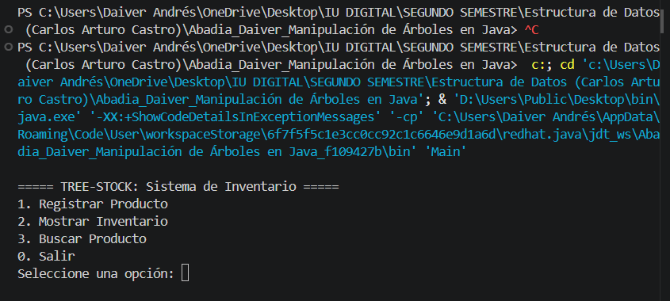
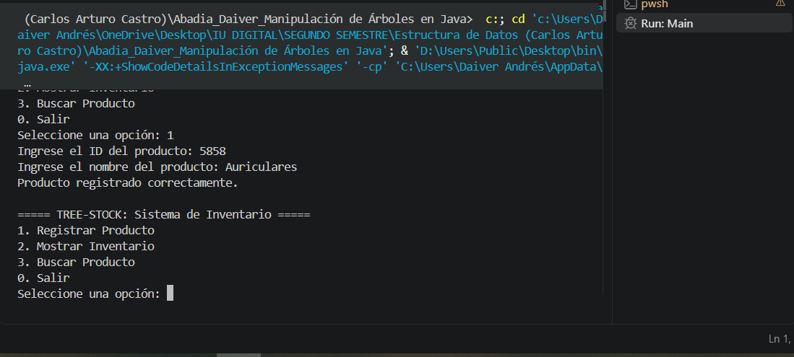
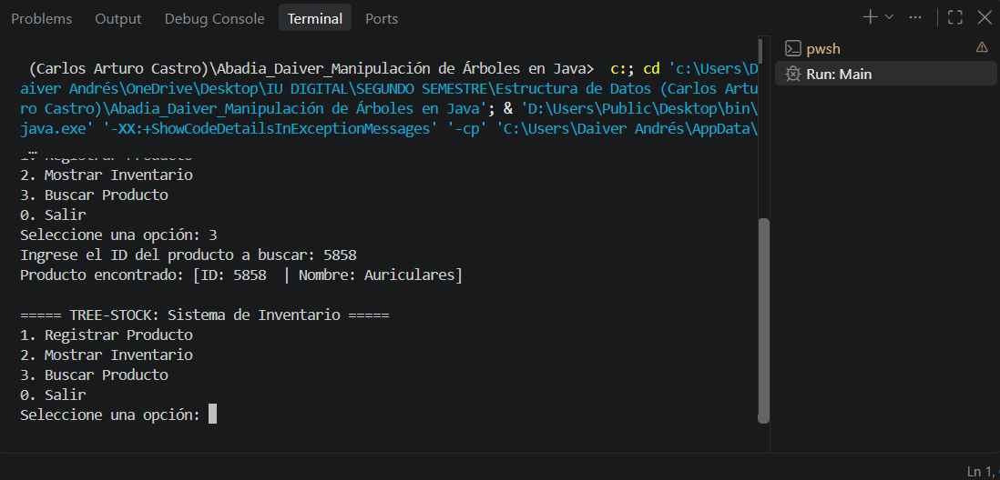

# Manipulación de Árboles en Java — Sistema de Inventario con BST

Proyecto académico que implementa un **Árbol Binario de Búsqueda (BST)** en Java para gestionar un inventario de productos, permitiendo insertar, buscar y listar productos ordenados por su ID.

## 🎯 Objetivo

Comprender el concepto de árbol binario de búsqueda y su estructura lógica, siendo capaz de aplicarlo en un sistema de clasificación o inventario, implementado en Java. La actividad busca evaluar la capacidad de implementar estructuras dinámicas manualmente, trabajar en equipo y aplicar control de versiones con GitHub.

## 📋 Descripción

El sistema modela cada producto como un nodo de un árbol binario de búsqueda, donde el **ID del producto** funciona como clave de ordenamiento. Esto permite realizar operaciones de inserción y búsqueda de forma eficiente mediante recursión, y obtener el listado completo de productos ordenado ascendentemente por ID a través de un recorrido inorden.

## 🗂️ Estructura del proyecto

```
├── Producto.java          # Clase que representa un nodo del árbol (el producto)
├── ArbolInventario.java   # Lógica del BST: insertar, buscar, recorrido inorden
└── Main.java               # Clase principal con el menú interactivo (interfaz)
```

## 🧩 Clases

### `Producto`
Representa un nodo del árbol. Contiene:
- `id` (int): identificador único, usado como clave del BST.
- `nombre` (String): nombre del producto.
- `izquierdo` / `derecho`: referencias a los nodos hijos.

### `ArbolInventario`
Contiene la lógica del árbol:
- `insertar(int id, String nombre)`: inserta un nuevo producto según su ID, evitando duplicados.
- `buscar(int id)`: busca un producto por ID y devuelve el `Producto` encontrado o `null`.
- `mostrarInorden()`: imprime todos los productos ordenados ascendentemente por ID.

### `Main`
Clase de interfaz con un **menú interactivo por consola** (`switch-case` dentro de un bucle) que permite:
1. **Registrar Producto**: solicita ID y nombre, y lo inserta en el árbol.
2. **Mostrar Inventario**: ejecuta el recorrido inorden y lista los productos ordenados por ID.
3. **Buscar Producto**: solicita un ID e informa si el producto existe o no.
0. **Salir**: termina el programa.

## ▶️ Cómo ejecutar

### Desde Visual Studio Code
1. Abre la carpeta del proyecto en VS Code.
2. Asegúrate de tener instalado el **JDK** y el **Extension Pack for Java**.
3. Abre `Main.java` y haz clic en el botón **Run** que aparece encima de `main`.

### Desde la terminal
```bash
javac Producto.java ArbolInventario.java Main.java
java Main
```

## 📤 Ejemplo de uso

```
===== TREE-STOCK: Sistema de Inventario =====
1. Registrar Producto
2. Mostrar Inventario
3. Buscar Producto
0. Salir
Seleccione una opción: 1
Ingrese el ID del producto: 50
Ingrese el nombre del producto: Teclado mecánico
Producto registrado correctamente.

Seleccione una opción: 1
Ingrese el ID del producto: 30
Ingrese el nombre del producto: Mouse inalámbrico
Producto registrado correctamente.

Seleccione una opción: 2
--- Inventario (ordenado por ID) ---
[ID: 30    | Nombre: Mouse inalámbrico]
[ID: 50    | Nombre: Teclado mecánico]

Seleccione una opción: 3
Ingrese el ID del producto a buscar: 50
Producto encontrado: [ID: 50    | Nombre: Teclado mecánico]

Seleccione una opción: 0
Saliendo del sistema. ¡Hasta luego!
```

## 🖼️ Capturas de pantalla

> Reemplaza estas líneas con tus propias capturas. En GitHub, arrastra la imagen al editor del README (o al issue) para obtener el enlace, y pégalo con el formato ``.

**Menú principal**



**Registro de un producto (inserción)**



**Búsqueda de un producto**



## 🚀 Posibles mejoras futuras

- Método para eliminar un producto del árbol.
- Cálculo de la altura del árbol y conteo de nodos.
- Persistencia de datos (guardar/cargar el inventario desde un archivo).

## 👤 Autor

- **Nombre:** Daiver Abadía
- **Asignatura:** Estructura de Datos
- **Semestre:** Segundo Semestre
- **Docente:** Carlos Arturo Castro
- **Tema:** Manipulación de Árboles en Java
